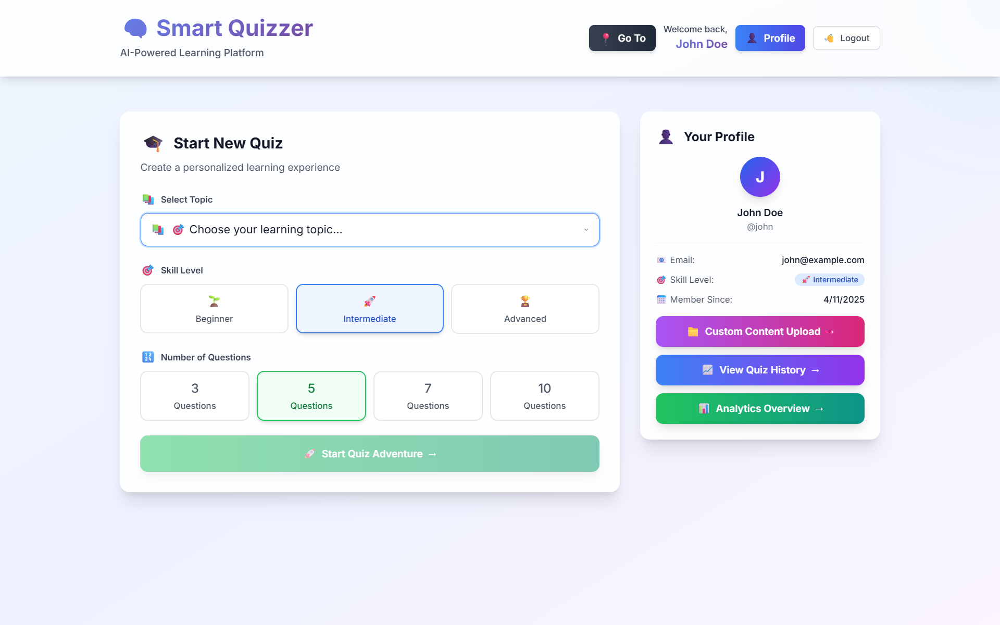
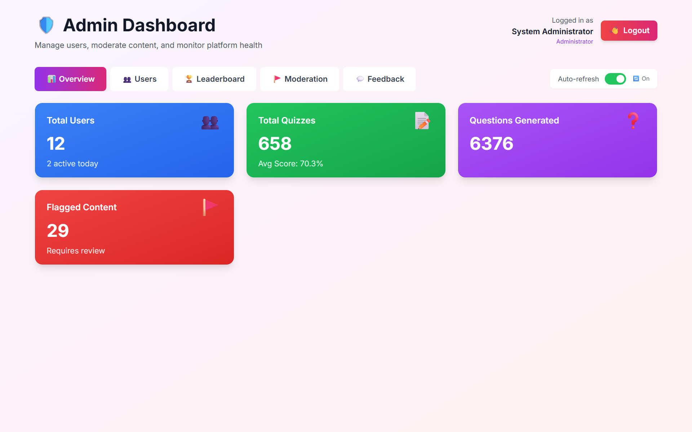
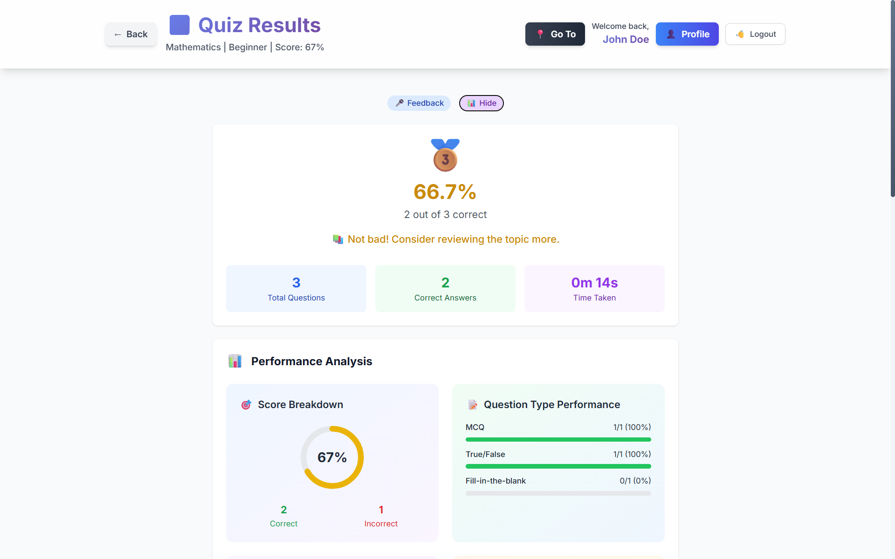
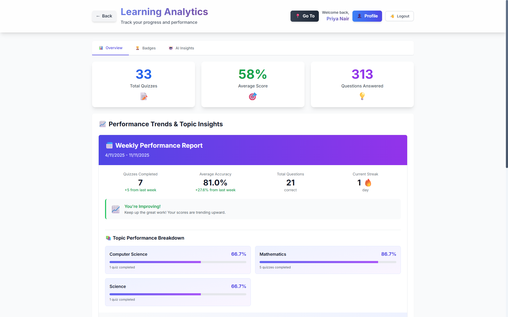
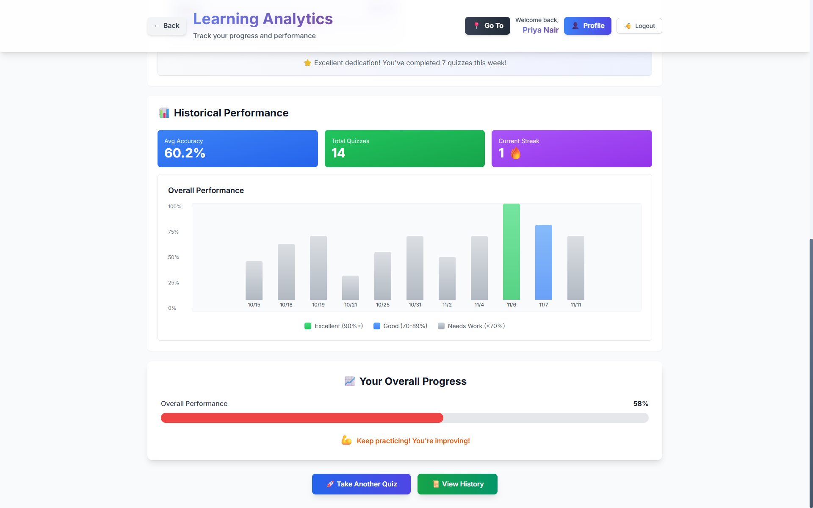
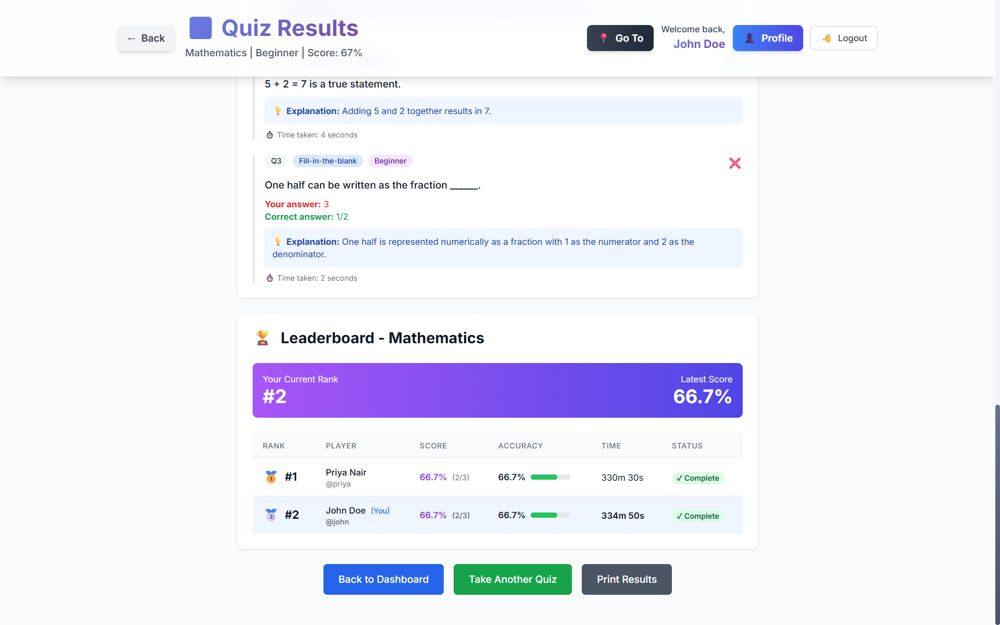
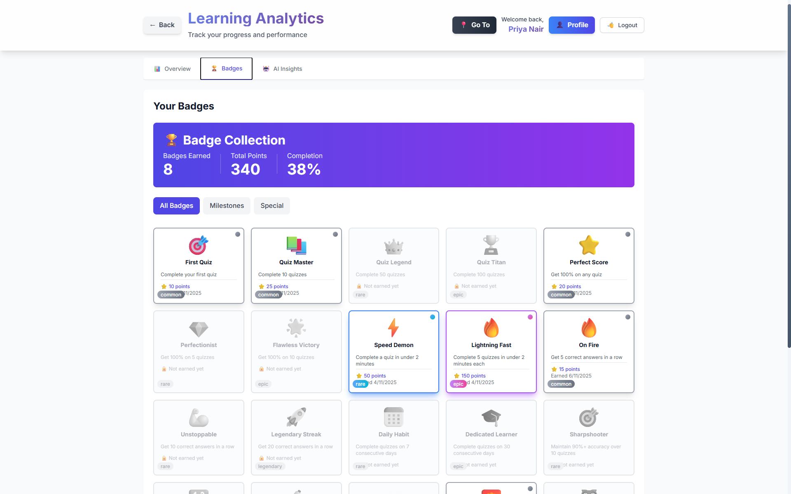

# 🎓 Smart Quizzer AI

An intelligent, adaptive learning platform that uses AI to generate personalized quizzes and provide real-time performance analytics.

[](https://reactjs.org/)
[](https://flask.palletsprojects.com/)
[](https://www.python.org/)
[](https://www.typescriptlang.org/)
[](LICENSE)

---

## 📋 Overview

Smart Quizzer AI is an adaptive learning platform that transforms educational content into interactive quizzes. Using advanced AI and NLP, it generates contextually relevant questions, evaluates answers semantically, and adapts difficulty based on user performance.

**Perfect for:**
- 🎓 Students preparing for exams
- 👨‍🏫 Educators creating dynamic assessments
- 💼 Corporate training programs
- 📚 Self-paced learners

---

## 🎨 Features Overview

### User Dashboard & Quiz Interface

*Intuitive dashboard with quick access to quizzes, history, analytics, and profile management*

### Admin Dashboard & Moderation

*Comprehensive admin panel for user management, content moderation, and system monitoring*

---

## ✨ Core Features

### 🤖 AI-Powered Quiz Generation
- **Multi-format input**: PDFs, DOCX, URLs, and plain text
- **Google Gemini AI** integration for intelligent question creation
- **Question types**: Multiple Choice, True/False, Short Answer
- **Bloom's Taxonomy** classification (Easy, Medium, Hard)

### 🎯 Adaptive Learning Engine
- Real-time difficulty adjustment based on performance
- Tracks accuracy and completion time
- Personalized question selection using historical data
- Progressive difficulty scaling

### 🧠 Semantic Answer Evaluation
- **Sentence-Transformers** NLP model for intelligent grading
- Recognizes conceptually correct answers beyond exact matches
- Provides detailed explanations and hints
- Context-aware scoring

### 📊 Analytics & Leaderboards
- **Global leaderboard** ranked by accuracy and speed
- Individual progress tracking with performance trends
- Topic-wise analytics and skill assessment
- Visual charts for quiz history and growth metrics

### 🎮 Gamification System
- Achievement badges (Perfect Score, Quiz Master, Streak Winner)
- Skill progression: Beginner → Intermediate → Expert → Master
- Score streaks and milestone rewards
- Competitive rankings

### 👨‍💼 Admin Dashboard
- User management and platform monitoring
- Flagged content review and moderation
- System-wide analytics and statistics
- Quiz and feedback oversight

---

## 🛠️ Technology Stack

| Component | Technology | Purpose |
|-----------|-----------|---------|
| **Frontend** | React 18, TypeScript, Tailwind CSS | Modern, responsive UI |
| **Backend** | Flask (Python 3.9+) | REST API and business logic |
| **Database** | SQLite / PostgreSQL | Data persistence |
| **AI Engine** | Google Gemini AI | Question generation |
| **NLP** | Sentence-Transformers | Semantic answer evaluation |
| **Authentication** | JWT + BCrypt | Secure user sessions |
| **Real-time** | Flask-SocketIO | Live updates and multiplayer |
| **Deployment** | Docker, Nginx | Production environment |

---

## 🚀 Quick Start

### Prerequisites
- Python 3.9+
- Node.js 16+
- npm or yarn

### 1. Clone Repository
```bash
git clone https://github.com/BatchuMamatha/Smart-Quizzer-AI.git
cd Smart-Quizzer-AI
```

### 2. Backend Setup
```bash
cd backend
python -m venv venv

# Activate virtual environment
# Linux/Mac:
source venv/bin/activate
# Windows:
venv\Scripts\activate

# Install dependencies
pip install -r requirements.txt

# Initialize database
python init_database.py

# Start Flask server
python app.py
```
Backend will run at **http://localhost:5000**

### 3. Frontend Setup
```bash
cd frontend
npm install
npm start
```
Frontend will run at **http://localhost:3000**

### 4. Docker Setup (Alternative)
```bash
docker-compose up --build
```

---

## 📂 Project Structure

```
Smart-Quizzer-AI/
├── backend/
│   ├── app.py                    # Flask application entry point
│   ├── models.py                 # Database models (User, Quiz, Question)
│   ├── question_gen.py           # AI question generator (Gemini)
│   ├── answer_evaluator.py      # NLP-based answer evaluation
│   ├── init_database.py          # Database initialization script
│   ├── requirements.txt          # Python dependencies
│   └── utils/                    # Helper functions
│
├── frontend/
│   ├── src/
│   │   ├── pages/                # React pages
│   │   │   ├── Dashboard.tsx     # User dashboard
│   │   │   ├── Quiz.tsx          # Quiz interface
│   │   │   ├── Admin.tsx         # Admin panel
│   │   │   └── Leaderboard.tsx   # Global rankings
│   │   ├── components/           # Reusable UI components
│   │   ├── lib/                  # API clients and utilities
│   │   └── App.tsx               # Main application
│   ├── package.json              # Node dependencies
│   └── tsconfig.json             # TypeScript configuration
│
├── docker-compose.yml            # Docker orchestration
├── LICENSE                       # MIT License
└── README.md                     # Project documentation
```

---

## 📖 Usage Guide

### For Students/Users

1. **Register & Login**
   - Create an account or log in with existing credentials

2. **Upload Study Material**
   - Upload PDF/DOCX files, paste URLs, or enter text directly
   - System analyzes content and generates relevant questions

3. **Take a Quiz**
   - Select topic, difficulty level, and number of questions
   - Answer questions with real-time difficulty adaptation
   - Receive instant feedback with explanations

4. **Track Progress**
   - View quiz history and performance analytics
   - Check your leaderboard ranking
   - Earn badges and track skill progression

### For Administrators

1. **Access Admin Dashboard**
   - Monitor user activity and system statistics

2. **Content Moderation**
   - Review flagged questions and user feedback
   - Manage quiz content quality

3. **User Management**
   - View user profiles and activity logs
   - Manage user roles and permissions

4. **Analytics**
   - Access platform-wide performance metrics
   - Export data for reporting

---

## 🎯 Key Modules

### Backend Modules

| Module | Description |
|--------|-------------|
| `app.py` | Flask REST API endpoints |
| `models.py` | SQLAlchemy database models |
| `question_gen.py` | Gemini AI integration for question generation |
| `answer_evaluator.py` | Sentence-Transformer semantic evaluation |
| `init_database.py` | Database setup and default data |

### Frontend Components

| Component | Description |
|-----------|-------------|
| `Dashboard.tsx` | User home with analytics and quiz history |
| `Quiz.tsx` | Interactive quiz interface with timer |
| `Leaderboard.tsx` | Global and topic-specific rankings |
| `Admin.tsx` | Administrative controls and monitoring |
| `Analytics.tsx` | Performance visualization charts |

---

## 📊 Results and Analytics

### Quiz Performance Analysis

*Real-time performance analysis showing accuracy, completion time, and detailed answer breakdown*

### Learning Analytics Dashboard

*Comprehensive analytics dashboard with performance trends, topic mastery, and progress tracking*

### Detailed Analytics Insights

*In-depth performance metrics including weekly reports, badge progress, and personalized recommendations*

### Real-time Leaderboard

*Live competitive leaderboard showing global rankings based on accuracy, speed, and consistency*

### Badge Achievement System

*Gamification system displaying earned badges and achievement milestones*

---

## 🏆 Leaderboard Ranking

Rankings are calculated based on:
- **Accuracy Score** (weighted 60%)
- **Completion Time** (weighted 30%)
- **Consistency** (weighted 10%)

Updated in real-time after each quiz submission.

---

## 🔐 User Roles

| Role | Permissions |
|------|------------|
| **Student** | Take quizzes, view personal analytics, compete on leaderboards |
| **Admin** | Full access to user management, content moderation, system analytics |

---

## 🗺️ Roadmap

**Current Version: v1.0**

**Planned Features:**
- 🎤 Voice-based quiz mode
- 🌍 Multilingual support
- 📱 Mobile app (React Native)
- 🤝 Collaborative quiz challenges
- 📚 AI-powered study recommendations
- 🔌 LMS integrations (Moodle, Canvas)

---

## 🤝 Contributing

Contributions are welcome! Please follow these steps:

1. Fork the repository
2. Create a feature branch (`git checkout -b feature/AmazingFeature`)
3. Commit changes (`git commit -m 'Add AmazingFeature'`)
4. Push to branch (`git push origin feature/AmazingFeature`)
5. Open a Pull Request

---

## 📄 License

This project is licensed under the **MIT License** - see the [LICENSE](LICENSE) file for details.

---

## 👤 Maintainer

**Batchu Mamatha**

- 🔗 GitHub: [@BatchuMamatha](https://github.com/BatchuMamatha)
- 📧 Issues: [Report bugs or request features](https://github.com/BatchuMamatha/Smart-Quizzer-AI/issues)

---

## 🙏 Acknowledgments

- Google Gemini AI for intelligent question generation
- Sentence-Transformers for semantic evaluation
- React and Flask communities

---

<div align="center">

**⭐ Star this repository if you find it helpful!**

Made with ❤️ by Batchu Mamatha

</div>